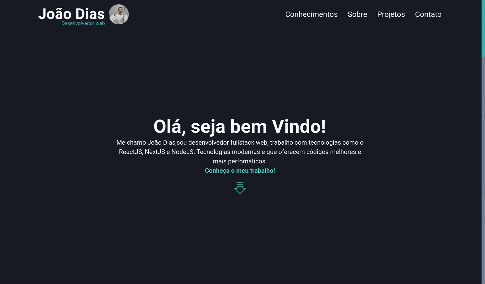

<h1 align="center">

Portfólio with NextJS and Chakra UI
</h1>
<br />
<br />





<p align="center">Project developed in order to show some of my projects developed throughout my career as a front-end dev.
</p>
<br />
<br />
<p align="center">
 <a href="#Technologies">Technologies</a> •
 <a href="#Get-Started">Get started</a> •
 <a href="#Developer">Developer</a>
</p>
<br />
<br />

  ##  🚀  Technologies

  This project was development with the following technologies

<br />

  -   ✅  Typescript
  -   ✅  NodeJS
  -   ✅  ReactJS
  -   ✅  NextJS
  -   ✅  ChakraUI
  -   ✅  Nodemailer
  -   ✅  Axios


<br />
<br />

## 🏁  Get started

### 🚧 To run the project, you must have installed [NodeJS](https://nodejs.org/en/) and, or [Yarn](https://yarnpkg.com/) 🚧
<br />

### First step is to open your terminal where you want to download the project.

<br />

### To download and initializing the project run the following command.

```bash
$ git clone https://github.com/joaoeduardodias/portfolio.git
$ cd portfolio
$ yarn

```

### Then run the following command to start the application

```bash
$ yarn start
```

### After downloading the dependencies and running the project, open the url "http://localhost:3000" in your browser and you will see the project on your local machine.

<br />
<br />
<br />

## Gif project web version


<br />
<br />

## Gif project mobile version
<div align="center" >
  
</div>
<br />
<br />
<br />

## 👨‍🔧 Developer
---
<br />
<a href="https://www.linkedin.com/in/devjoaodias/">
 
 <br />
 <sub><b>João Dias</b></sub></a> <a href="https://www.linkedin.com/in/devjoaodias/" title="João Dias">&nbsp;&nbsp;🚀</a>


Feito com ❤️ por João Dias 👋🏽 Entre em contato!

 [](https://www.linkedin.com/in/devjoaodias/)
[](mailto:joaoeduardodias123@gmail.com)
<br />
<br />

